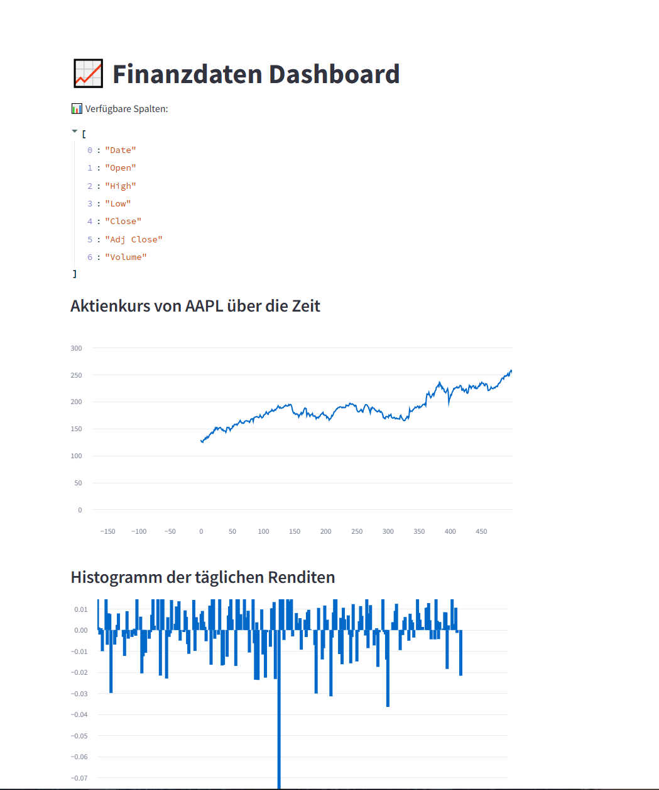

# 📈 Finanzanalyse-Dashboard mit Python & Streamlit 🚀

🔹 **Live-Demo**: [Hier klicken](https://dein-streamlit-link.streamlit.app)  
🔹 **Automatische Finanzdaten-Analyse & Visualisierung**  

---

## 💡 Features:
✅ **Live-Kursdaten von Yahoo Finance**  
✅ **Automatische tägliche Updates mit GitHub Actions**  
✅ **Interaktive Visualisierungen von Aktienkursen**  
✅ **Berechnung täglicher Renditen**  

---

## 📸 Screenshots:


---

## 🔥 Installation & Nutzung
1️⃣ **Clone das Repository**  
```bash
git clone https://github.com/dein-github/finanzanalyse-projekt.git
